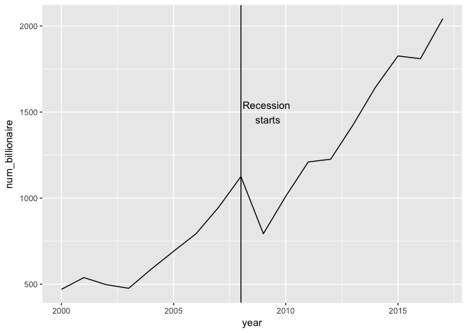
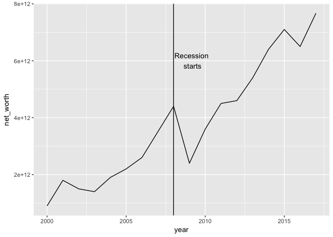
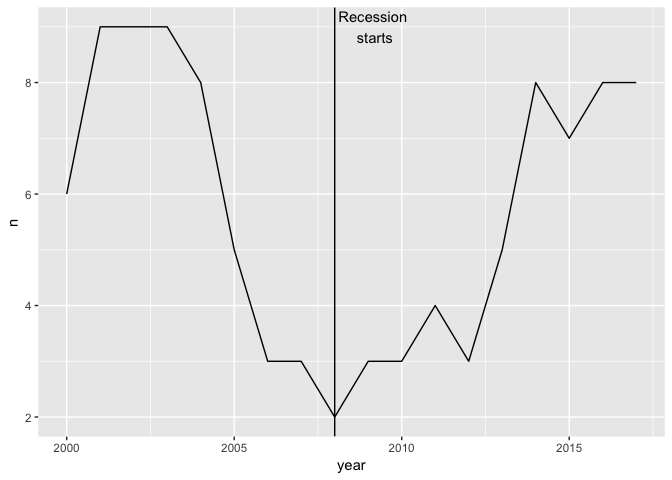
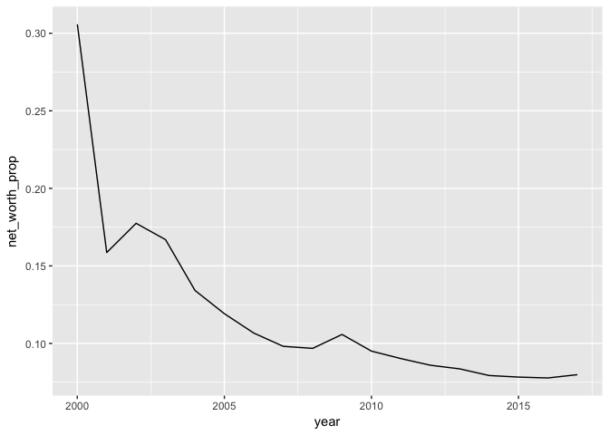
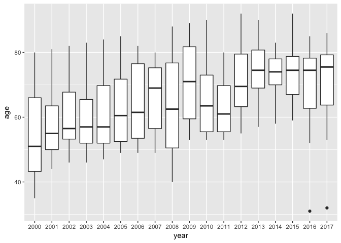
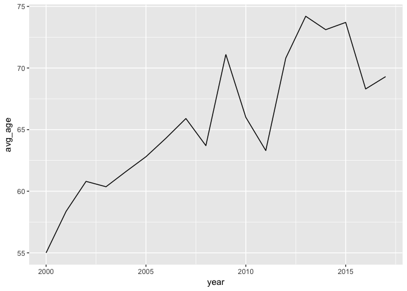
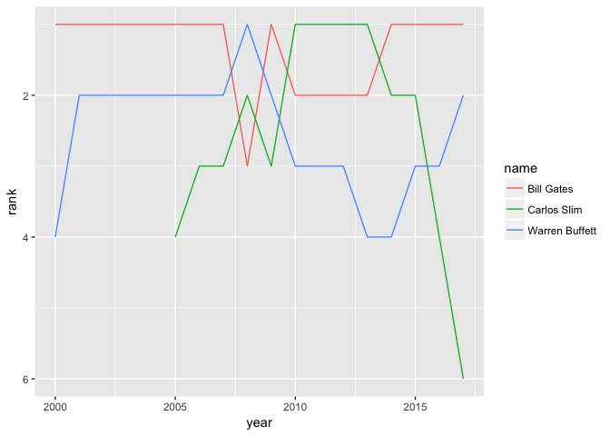

Billionaires
================
Yue
8/19/2017

``` r
library(tidyverse)
```

    ## Loading tidyverse: ggplot2
    ## Loading tidyverse: tibble
    ## Loading tidyverse: tidyr
    ## Loading tidyverse: readr
    ## Loading tidyverse: purrr
    ## Loading tidyverse: dplyr

    ## Conflicts with tidy packages ----------------------------------------------

    ## filter(): dplyr, stats
    ## lag():    dplyr, stats

``` r
library(compare)
```

    ## 
    ## Attaching package: 'compare'

    ## The following object is masked from 'package:base':
    ## 
    ##     isTRUE

``` r
library(lubridate)
```

    ## 
    ## Attaching package: 'lubridate'

    ## The following object is masked from 'package:base':
    ## 
    ##     date

``` r
library(rvest)
```

    ## Loading required package: xml2

    ## 
    ## Attaching package: 'rvest'

    ## The following object is masked from 'package:readr':
    ## 
    ##     guess_encoding

``` r
library(stringr)
```

``` r
url_data_billionaires <- 
  "https://en.wikipedia.org/wiki/The_World%27s_Billionaires"
```

Let's load the Wikipedia data first!

``` r
billionaires_total <-
  read_html(url_data_billionaires) %>% 
  html_node(css = "#mw-content-text > div > table:nth-child(89)") %>% 
  html_table(fill = TRUE) %>% 
  select(
    year = Year,
    num_billionaire = `Number of billionaires`,
    net_worth = `Group's combined net worth`
  )

billionaires_total$year <- billionaires_total$year %>% parse_number()
billionaires_total$num_billionaire <- billionaires_total$num_billionaire %>% parse_number()
billionaires_total$net_worth <- billionaires_total$net_worth %>% parse_number() * 1e12
```

Let's now look at a basic graph.

``` r
billionaires_total %>% 
  ggplot(aes(year, num_billionaire)) +
  geom_line() +
  geom_vline(xintercept = 2008) +
  annotate("text", x = 2009.2, y = 1500, label = "Recession \nstarts")
```



``` r
billionaires_total %>% 
  ggplot(aes(year, net_worth)) +
  geom_line() +
  geom_vline(xintercept = 2008) +
  annotate("text", x = 2009.2, y = 6e12, label = "Recession \nstarts")
```



It's actually interesting how similar the number of people and the net worth combined graphs are, but I guess that's to be expected. We see a general steep decline where the 2008 financial crash was in both of these scenarios.

Now let's look at individual billionaires.

``` r
year_table <- tibble(
  year = 2000:2017,
  table_num = c(84, 80, 76, 72, 68, 65, 63, 61, 59, 56, 53, 46, 41, 35, 29, 23, 18, 15)
)

all_billionaires <- tribble(~rank, ~name, ~net_worth, ~age, ~nationality, ~company)

billionaire <- function(year, table_num) {
    billionaire_year <- 
      read_html(url_data_billionaires) %>% 
      html_node(css = str_c("#mw-content-text > div > table:nth-child(", table_num, ")")) %>% 
      html_table(fill = TRUE) %>% 
      select(
        rank = `No.`,
        name = Name,
        net_worth = `Net worth (USD)`,
        age = Age,
        nationality = Nationality,
        company = `Source(s) of wealth`
      ) %>%
      mutate(
        year = year,
        age = as.integer(age)
      )
   return(billionaire_year) 
}
```

``` r
for (i in 1:nrow(year_table)) {
  all_billionaires <-
    billionaire(year_table$year[i], year_table$table_num[i]) %>% 
    bind_rows(all_billionaires)
}
```

``` r
all_billionaires$net_worth <- all_billionaires$net_worth %>% parse_number() * 1e9
all_billionaires$rank <- 
  all_billionaires$rank %>% 
  stringr::str_extract("♠\\d+") %>% 
  parse_number()
all_billionaires$name <-
  all_billionaires$name %>% 
  stringr::str_extract("[A-Z][a-z]+\\s[A-z-]+")

all_billionaires %>% 
  head(n = 10)
```

    ##    rank              name net_worth age   nationality
    ## 1     1        Bill Gates  8.60e+10  61 United States
    ## 2     2    Warren Buffett  7.56e+10  86 United States
    ## 3     3        Jeff Bezos  7.28e+10  53 United States
    ## 4     4    Amancio Ortega  7.13e+10  80         Spain
    ## 5     5   Mark Zuckerberg  5.60e+10  32 United States
    ## 6     6       Carlos Slim  5.45e+10  77        Mexico
    ## 7     7     Larry Ellison  5.22e+10  72 United States
    ## 8     8      Charles Koch  4.83e+10  81 United States
    ## 9     8        David Koch  4.83e+10  76 United States
    ## 10   10 Michael Bloomberg  4.75e+10  75 United States
    ##                       company year
    ## 1                   Microsoft 2017
    ## 2          Berkshire Hathaway 2017
    ## 3                  Amazon.com 2017
    ## 4               Inditex, Zara 2017
    ## 5                    Facebook 2017
    ## 6  América Móvil, Grupo Carso 2017
    ## 7          Oracle Corporation 2017
    ## 8             Koch Industries 2017
    ## 9             Koch Industries 2017
    ## 10             Bloomberg L.P. 2017

``` r
all_billionaires %>% 
  filter(nationality == "United States") %>% 
  count(year) %>% 
  ggplot(aes(year, n)) +
  geom_line() +
  geom_vline(xintercept = 2008) +
  annotate("text", x = 2009.2, y = 9, label = "Recession \nstarts")
```



``` r
all_billionaires %>% 
  group_by(year) %>% 
  summarize(total = sum(net_worth)) %>% 
  left_join(billionaires_total, by = c("year")) %>% 
  mutate(net_worth_prop = total / net_worth) %>% 
  ggplot(aes(year, net_worth_prop)) +
  geom_line()
```



``` r
all_billionaires %>% 
  mutate(year = as.factor(year)) %>% 
  ggplot(aes(year, age)) +
  geom_boxplot()
```

    ## Warning: Removed 1 rows containing non-finite values (stat_boxplot).



``` r
all_billionaires %>% 
  filter(!is.na(age)) %>% 
  group_by(year) %>% 
  mutate(avg_age = mean(age)) %>% 
  ggplot(aes(year, avg_age)) +
  geom_line()
```



``` r
all_billionaires %>% 
  count(name, sort = TRUE)
```

    ## # A tibble: 39 x 2
    ##                name     n
    ##               <chr> <int>
    ##  1       Bill Gates    18
    ##  2   Warren Buffett    18
    ##  3    Larry Ellison    14
    ##  4      Carlos Slim    13
    ##  5   Amancio Ortega    10
    ##  6   Lakshmi Mittal     7
    ##  7       Paul Allen     7
    ##  8  Bernard Arnault     6
    ##  9       Jim Walton     6
    ## 10 Prince Al-Waleed     6
    ## # ... with 29 more rows

``` r
all_billionaires %>% 
  filter(name %in% c("Bill Gates", "Warren Buffett", "Carlos Slim")) %>% 
  ggplot(aes(year, rank, color = name)) +
  geom_line() +
  scale_y_reverse()
```


