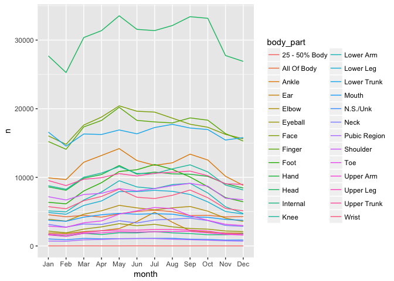

Untitled
================

``` r
library(neiss)
library(tidyverse)
```

    ## Loading tidyverse: ggplot2
    ## Loading tidyverse: tibble
    ## Loading tidyverse: tidyr
    ## Loading tidyverse: readr
    ## Loading tidyverse: purrr
    ## Loading tidyverse: dplyr

    ## Conflicts with tidy packages ----------------------------------------------

    ## filter(): dplyr, stats
    ## lag():    dplyr, stats

``` r
library(knitr)
```

``` r
glimpse(injuries)
```

    ## Observations: 2,332,957
    ## Variables: 18
    ## $ case_num    <int> 90101432, 90101434, 90101435, 90101436, 90101437, ...
    ## $ trmt_date   <date> 2009-01-01, 2009-01-01, 2009-01-01, 2009-01-01, 2...
    ## $ psu         <dbl> 61, 61, 61, 61, 61, 61, 61, 61, 61, 61, 61, 61, 61...
    ## $ weight      <dbl> 15.3491, 15.3491, 15.3491, 15.3491, 15.3491, 15.34...
    ## $ stratum     <chr> "V", "V", "V", "V", "V", "V", "V", "V", "V", "V", ...
    ## $ age         <dbl> 5.00, 51.00, 2.00, 20.00, 20.00, 47.00, 12.00, 21....
    ## $ sex         <chr> "Male", "Male", "Female", "Male", "Male", "Female"...
    ## $ race        <chr> "Other / Mixed Race", "White", "White", "White", "...
    ## $ race_other  <chr> "hispanic", NA, NA, NA, NA, "asian", NA, NA, "unkn...
    ## $ diag        <chr> "Strain, Sprain", "Contusion Or Abrasion", "Lacera...
    ## $ diag_other  <chr> NA, NA, NA, NA, NA, NA, "paronychia toe", NA, NA, ...
    ## $ body_part   <chr> "Neck", "Eyeball", "Face", "Toe", "Wrist", "Knee",...
    ## $ disposition <chr> "Released", "Released", "Released", "Released", "R...
    ## $ location    <chr> "Home", "Home", "Home", "Home", "Sports Or Recreat...
    ## $ fmv         <chr> "No fire/flame/smoke", "No fire/flame/smoke", "No ...
    ## $ prod1       <dbl> 1807, 899, 4057, 1884, 3283, 3283, 1659, 3265, 184...
    ## $ prod2       <dbl> NA, NA, NA, NA, NA, NA, NA, NA, NA, NA, NA, 3277, ...
    ## $ narrative   <chr> "5 YOM ROLLING ON FLOOR DOING A SOMERSAULT AND SUS...

``` r
glimpse(products)
```

    ## Observations: 1,114
    ## Variables: 2
    ## $ code  <int> 101, 102, 103, 106, 107, 108, 110, 112, 113, 114, 115, 1...
    ## $ title <chr> "washing machines without wringers or oth", "wringer was...

``` r
injuries <-
  injuries %>% 
  left_join(products, by = c("prod1" = "code"))
```

``` r
injuries %>% 
  count(body_part, sort = TRUE) %>% 
  head() %>% 
  kable()
```

| body\_part  |       n|
|:------------|-------:|
| Head        |  364555|
| Face        |  212355|
| Finger      |  208115|
| Lower Trunk |  197310|
| Ankle       |  140382|
| Knee        |  121244|

``` r
injuries %>% 
  count(title, sort = TRUE) %>% 
  head() %>% 
  kable()
```

| title                                    |       n|
|:-----------------------------------------|-------:|
| stairs or steps                          |  195807|
| floors or flooring materials             |  157511|
| beds or bedframes, other or not spec     |  100812|
| basketball (activity, apparel or equip.) |   95524|
| bicycles and accessories (excl mountain  |   89420|
| football (activity, apparel or equip.)   |   81468|

``` r
injuries %>% 
  count(diag, sort = TRUE) %>% 
  head() %>% 
  kable()
```

| diag                  |       n|
|:----------------------|-------:|
| Laceration            |  446360|
| Strain, Sprain        |  387202|
| Contusion Or Abrasion |  371831|
| Fracture              |  346190|
| Other Or Not Stated   |  252169|
| Inter Organ Injury    |  206947|

``` r
injuries <-
  injuries %>% 
  mutate(
    month = lubridate::month(trmt_date, label = TRUE),
    year = lubridate::year(trmt_date)
  )
```

``` r
injuries %>%
  count(month) %>% 
  ggplot(aes(month, n, group = 1)) +
  geom_line()
```


``` r
injuries %>% 
  count(year) %>% 
  ggplot(aes(year, n)) +
  geom_line()
```


``` r
injuries %>% 
  count(year, body_part, sort = TRUE) %>% 
  ggplot(aes(year, n, color = body_part)) +
  geom_line()
```


``` r
injuries %>% 
  count(month, body_part, sort = TRUE) %>% 
  ggplot(aes(month, n, color = body_part, group = body_part)) +
  geom_line()
```



``` r
injuries %>% 
  count(month, body_part) %>% 
  group_by(month) %>% 
  mutate(rank = min_rank(-n)) %>% 
  arrange(rank) %>% 
  ggplot(aes(month, rank, color = body_part, group = body_part)) +
  geom_line() +
  scale_y_reverse()
```


``` r
injuries %>% 
  count(year, body_part) %>% 
  group_by(year) %>% 
  mutate(rank = min_rank(-n)) %>% 
  arrange(rank) %>% 
  ggplot(aes(year, rank, color = body_part, group = body_part)) +
  geom_line() +
  scale_y_reverse()
```


``` r
gen_color <- function(body_parts, part) {
  color = setNames(rep("grey50", times = length(body_parts)), body_parts)
  color[part] = setNames("green", part)
  color
}
```

``` r
injury_rank_month <-
  injuries %>% 
  count(month, body_part) %>% 
  group_by(month) %>% 
  mutate(rank = min_rank(-n)) %>% 
  arrange(month)
injury_rank_year <-
  injuries %>% 
  count(year, body_part) %>% 
  group_by(year) %>% 
  mutate(rank = min_rank(-n)) %>% 
  arrange(rank)
line_colors <- gen_color(distinct(injury_rank_month, body_part) %>% .$body_part, "Foot")
```

``` r
injuries %>% 
  filter(sex != "None listed") %>% 
  count(sex, month, body_part) %>% 
  group_by(sex, month) %>% 
  mutate(rank = min_rank(-n)) %>% 
  ggplot(aes(month, rank, color = body_part, group = body_part)) +
  facet_grid(sex ~ .) +
  geom_line() +
  scale_y_reverse() +
  scale_color_manual(values = line_colors)
```


``` r
deadliest_products <-
  injuries %>% 
  count(title) %>% 
  arrange(desc(n)) %>% 
  slice(1:15) %>% 
  .$title
```

``` r
head(deadliest_products, n = 15)
```

    ##  [1] "stairs or steps"                         
    ##  [2] "floors or flooring materials"            
    ##  [3] "beds or bedframes, other or not spec"    
    ##  [4] "basketball (activity, apparel or equip.)"
    ##  [5] "bicycles and accessories (excl mountain" 
    ##  [6] "football (activity, apparel or equip.)"  
    ##  [7] "doors, other or not specified"           
    ##  [8] "chairs, other or not specified"          
    ##  [9] "ceilings and walls (part of completed st"
    ## [10] "tables, not elsewhere classified"        
    ## [11] "knives, not elsewhere classified"        
    ## [12] "bathtubs or showers"                     
    ## [13] "soccer (activity, apparel or equip.)"    
    ## [14] "exercise (activity or apparel, w/o equip"
    ## [15] "sofas, couches, davenports, divans or st"

``` r
line_colors2 <- gen_color(deadliest_products, "bicycles and accessories (excl mountain")
injuries %>% 
  filter(title %in% deadliest_products & sex != "None listed") %>% 
  count(sex, month, title) %>% 
  group_by(sex, month) %>% 
  mutate(rank = min_rank(-n)) %>% 
  ggplot(aes(month, rank, color = title, group = title)) +
  geom_line() +
  facet_grid(sex ~ .) +
  scale_y_reverse() +
  scale_color_manual(values = line_colors2)
```


``` r
round_decade <- function(age) {
  round(age - 5, -1)
} 

injuries %>% 
  mutate(decade = round_decade(age)) %>% 
  count(title, decade) %>% 
  group_by(decade) %>% 
  filter(min_rank(desc(n)) <= 5) %>% 
  arrange(decade, desc(n)) %>% 
  kable()
```

| title                                    |  decade|      n|
|:-----------------------------------------|-------:|------:|
| beds or bedframes, other or not spec     |       0|  44021|
| stairs or steps                          |       0|  33327|
| floors or flooring materials             |       0|  32512|
| tables, not elsewhere classified         |       0|  28195|
| bicycles and accessories (excl mountain  |       0|  26579|
| basketball (activity, apparel or equip.) |      10|  59134|
| football (activity, apparel or equip.)   |      10|  57555|
| soccer (activity, apparel or equip.)     |      10|  25740|
| bicycles and accessories (excl mountain  |      10|  23356|
| stairs or steps                          |      10|  19984|
| stairs or steps                          |      20|  32184|
| basketball (activity, apparel or equip.) |      20|  19126|
| knives, not elsewhere classified         |      20|  12967|
| bicycles and accessories (excl mountain  |      20|  12345|
| exercise (activity or apparel, w/o equip |      20|  11441|
| stairs or steps                          |      30|  23359|
| floors or flooring materials             |      30|   8673|
| knives, not elsewhere classified         |      30|   7321|
| bicycles and accessories (excl mountain  |      30|   6532|
| exercise (activity or apparel, w/o equip |      30|   6298|
| stairs or steps                          |      40|  28230|
| floors or flooring materials             |      40|  13239|
| bicycles and accessories (excl mountain  |      40|   8715|
| knives, not elsewhere classified         |      40|   7276|
| exercise (activity or apparel, w/o equip |      40|   6239|
| stairs or steps                          |      50|  20669|
| floors or flooring materials             |      50|  13994|
| bicycles and accessories (excl mountain  |      50|   6681|
| beds or bedframes, other or not spec     |      50|   5687|
| knives, not elsewhere classified         |      50|   4940|
| stairs or steps                          |      60|  16933|
| floors or flooring materials             |      60|  16323|
| beds or bedframes, other or not spec     |      60|   7035|
| chairs, other or not specified           |      60|   4406|
| bathtubs or showers                      |      60|   4171|
| floors or flooring materials             |      70|  15726|
| stairs or steps                          |      70|  10284|
| beds or bedframes, other or not spec     |      70|   7106|
| chairs, other or not specified           |      70|   3933|
| bathtubs or showers                      |      70|   2800|
| floors or flooring materials             |      80|  27314|
| beds or bedframes, other or not spec     |      80|  12179|
| stairs or steps                          |      80|   9428|
| chairs, other or not specified           |      80|   6227|
| bathtubs or showers                      |      80|   3329|
| floors or flooring materials             |      90|   8756|
| beds or bedframes, other or not spec     |      90|   4040|
| chairs, other or not specified           |      90|   1838|
| stairs or steps                          |      90|   1390|
| toilets                                  |      90|    893|
| floors or flooring materials             |     100|    400|
| beds or bedframes, other or not spec     |     100|    220|
| chairs, other or not specified           |     100|     81|
| toilets                                  |     100|     49|
| crutches, canes or walkers               |     100|     41|
| wheelchairs                              |     100|     41|
| floors or flooring materials             |     110|      1|

``` r
injuries %>%
  filter(sex != "None listed") %>% 
  count(sex, month) %>% 
  ggplot(aes(month, n, color = sex, group = sex)) +
  geom_line()
```


``` r
injuries %>% 
  filter(sex != "None listed") %>% 
  count(sex, year) %>% 
  ggplot(aes(year, n, color = sex)) +
  geom_line() 
```


``` r
injuries %>% 
  ggplot(aes(age)) +
  geom_histogram(binwidth = 1)
```


``` r
injuries %>% 
  filter(title %in% deadliest_products) %>% 
  mutate(decade = round_decade(age)) %>% 
  count(title, age) %>% 
  ggplot(aes(age, n, color = title)) +
  geom_line()
```


``` r
injuries %>% 
  filter(title %in% deadliest_products) %>% 
  ggplot(aes(age, color = title)) +
  geom_freqpoly(aes(y = ..density..), binwidth = 5)
```


``` r
injuries %>% 
  filter(title %in% deadliest_products) %>% 
  mutate(decade = round_decade(age)) %>% 
  count(decade, title) %>% 
  group_by(decade) %>% 
  mutate(rank = min_rank(-n)) %>% 
  ggplot(aes(decade, rank, color = title)) +
  geom_line() +
  scale_y_reverse()
```


``` r
injuries %>% 
  mutate(decade = round_decade(age)) %>% 
  count(decade, body_part) %>% 
  group_by(decade) %>% 
  mutate(rank = min_rank(-n)) %>% 
  ggplot(aes(decade, rank, color = body_part)) +
  geom_line() +
  scale_y_reverse()
```


