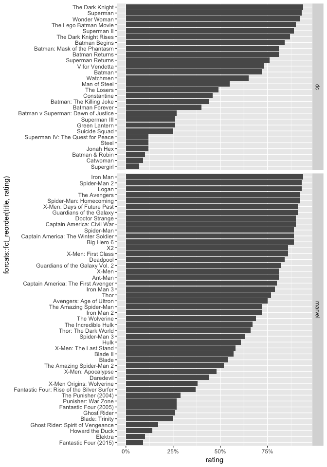
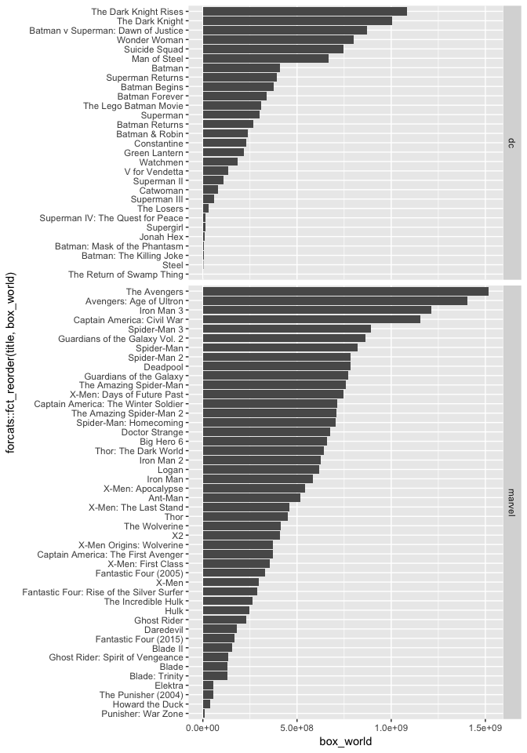
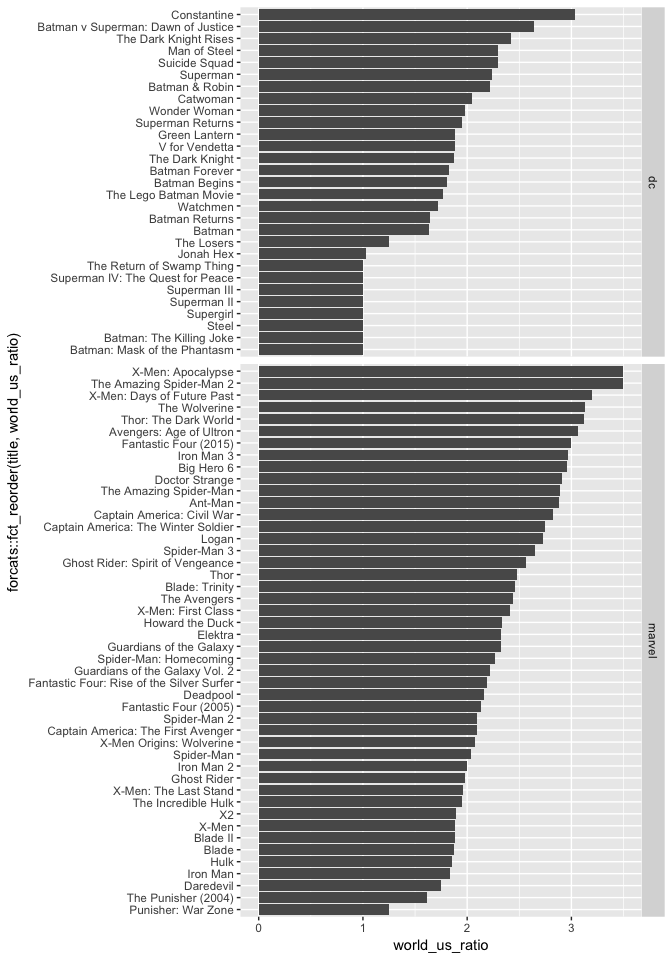
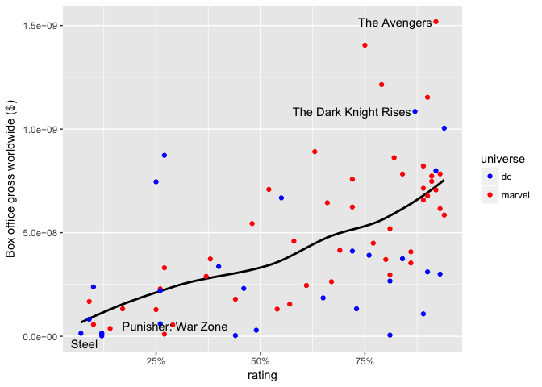
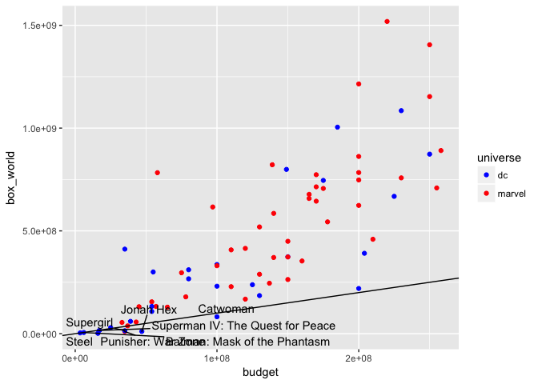
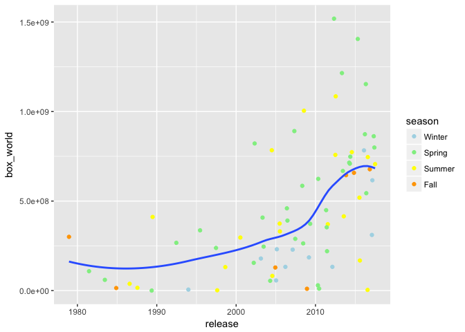
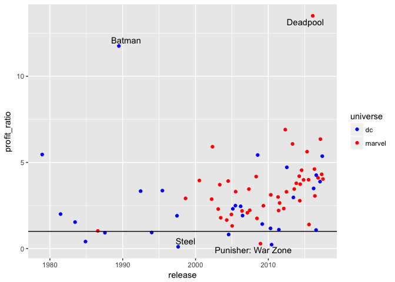
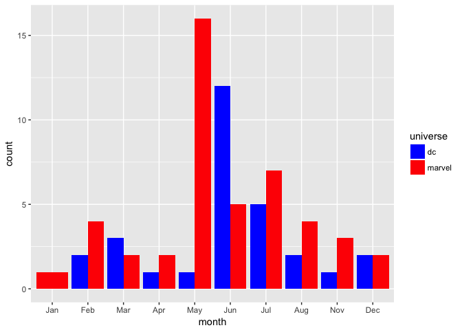
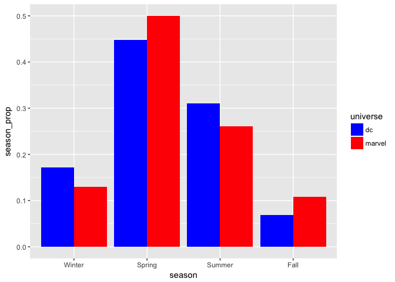
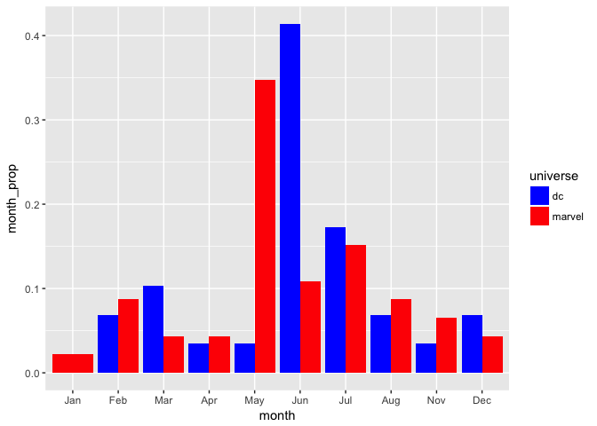

Marvel vs Superman
================
Yue
8/18/2017

``` r
url_data_marvel <- 
  "https://en.wikipedia.org/wiki/List_of_films_based_on_Marvel_Comics"
url_data_dc <- 
  "https://en.wikipedia.org/wiki/List_of_films_based_on_DC_Comics"
```

First, let's get the Marvel data. I'm pulling this from Wikipedia. We'll do something similar with the DC data.

``` r
marvel <-
  read_html(url_data_marvel) %>% 
  html_node(css = "#mw-content-text > div > table:nth-child(28)") %>% 
  html_table(fill = TRUE)

colnames(marvel)[5:8] <- str_c(colnames(marvel)[5:8], " ", marvel[1,5:8])
marvel <-
  marvel %>% 
  slice(-1) %>% 
  select(
    title = Title,
    distributor = `Distributor(s)`,
    release = `Release date\n(United States)`,
    budget = `Budget\n(in millions)`,
    box_opening = `Box office gross[28] Opening weekend\n(North America)`,
    box_na = `Box office gross[28] North America`,
    box_world = `Box office gross[28] Worldwide`
  ) 

marvel$release <- marvel$release %>% parse_date("%B %d, %Y")
```

    ## Warning in rbind(names(probs), probs_f): number of columns of result is not
    ## a multiple of vector length (arg 1)

    ## Warning: 2 parsing failures.
    ## row # A tibble: 2 x 4 col     row   col            expected  actual expected   <int> <int>               <chr>   <chr> actual 1    47    NA date like %B %d, %Y   Total row 2    48    NA date like %B %d, %Y Average

``` r
marvel$box_opening <- parse_number(marvel$box_opening)
marvel$box_na <- parse_number(marvel$box_na)
marvel$budget <- parse_number(marvel$budget) * 1e6
marvel$box_world <- parse_number(marvel$box_world)

marvel <-
  marvel %>% 
  filter(!is.na(release))
```

Now, let's get the rating, which is in a separate table. One of the things we want to do is get rid of some of the ratings with less than 20. It's not significant enough to say that these reviews mean anything when only 20 people have reviewed it.

``` r
marvel_rating <-
  read_html(url_data_marvel) %>% 
  html_node(css = "#mw-content-text > div > table:nth-child(30)") %>% 
  html_table(fill = TRUE) %>% 
  select(Film, rating = `Rotten Tomatoes`) %>% 
  mutate(
    review_num = str_extract(rating, "\\d+( reviews)"),
    review_num = parse_number(review_num),
    rating = parse_number(rating)
  ) %>% 
  filter(review_num > 20)
```

Now we'll join those two tables together. Here's where things get tricky: we have a few movies in the marvel universe that are repeats, and some of these repeats have information on the box office, and some don't. Because the ratings table doesn't have a date next to it, there are two Fantastic Four's that are labeled with (2005) and (2015). And what's worse, we have two The Punisher, one of them without any box office information. Joining these two tables will be annoying... So first, I'm going to make sure we don't miss The Fantastic Four by counting all of the Fantastic Four's in the first table. Then I'm going to see which one is NA (since all the movies have ratings, but not necessarily box office info) and add the year. This should take care of everything!

``` r
marvel <-
  marvel %>% 
  count(title) %>% 
  left_join(marvel, ., by = "title") %>% 
  mutate(
    title = ifelse(n > 1, str_c(title, " (", lubridate::year(marvel$release), ")"), title),
    universe = "marvel"
  ) %>% 
  left_join(marvel_rating, by = c("title" = "Film")) %>% 
  mutate(title = ifelse(is.na(rating), str_c(title, " (", lubridate::year(marvel$release), ")"), title)) %>% 
  select(-rating, -n, -review_num) %>% 
  left_join(marvel_rating, by = c("title" = "Film"))
```

Now, let's get the DC data. This is a lot less tricky than the Marvel movies, phew!

``` r
dc <-
  read_html(url_data_dc) %>% 
  html_node(css = "#mw-content-text > div > table:nth-child(33)") %>% 
  html_table(fill = TRUE)
colnames(dc)[5:7] <- str_c(colnames(dc)[5:7], " ", dc[1,5:7])

dc <- 
  dc %>% 
  slice(-1) %>% 
  select(
    title = Title,
    distributor = `Distributor(s)`,
    release = `Release date\n(United States)`,
    budget = `Budget\n(millions)`,
    box_opening = `Box office gross[8] Opening weekend\n(North America)`,
    box_na = `Box office gross[8] North America`,
    box_world = `Box office gross[8] Worldwide`
  ) 

dc$release <- dc$release %>% parse_date("%B %d, %Y")
dc$box_opening <- parse_number(dc$box_opening)
dc$box_na <- parse_number(dc$box_na)
dc$budget <- parse_number(dc$budget) * 1e6
dc$box_world <- parse_number(dc$box_world)

dc <-
  dc %>% 
  filter(title != "Total")
```

And now, the ratings!

``` r
dc_rating <-
  read_html(url_data_dc) %>% 
  html_node(css = "#mw-content-text > div > table:nth-child(35)") %>% 
  html_table(fill = TRUE) %>% 
  select(Film, rating = `Rotten Tomatoes`) %>% 
  mutate(
    review_num = str_extract(rating, "\\d+( reviews)"),
    review_num = parse_number(review_num),
    rating = parse_number(rating)
  ) %>% 
  filter(review_num > 20)
```

    ## Warning: 1 parsing failure.
    ## row # A tibble: 1 x 4 col     row   col expected actual expected   <int> <int>    <chr>  <chr> actual 1    32    NA a number      .

And join the two (really easily!)

``` r
dc <-
  dc %>% 
  left_join(dc_rating, by = c("title" = "Film")) %>% 
  mutate(universe = "dc") 
```

And now let's put that into one large table!

``` r
all_universe <-
  dc %>% 
  merge(marvel, all = TRUE) %>% 
  mutate(rating = rating / 100)
```

Let's first do a quick sketch of some of our key variables. What's the distribution of the ratings?

``` r
all_universe %>% 
  filter(!is.na(rating)) %>% 
  ggplot(aes(forcats::fct_reorder(title, rating), rating)) +
  facet_grid(universe ~ ., scale = "free_y", space = "free") +
  geom_col() +
  coord_flip() +
  scale_y_continuous(labels = scales::percent)
```



We can see that both of the universes have a generally a wide variety of good ratings. The distributions almost look similar. Marvel definitely seems to have more positive ratings, but that's also skewed by the fact that Marvel has a larger selection of movies.

How does it do in box office?

``` r
all_universe %>% 
  filter(!is.na(box_world)) %>% 
  ggplot(aes(forcats::fct_reorder(title, box_world), box_world)) +
  facet_grid(universe ~ ., scale = "free_y", space = "free") +
  geom_col() +
  coord_flip() 
```



Well, it seems like Marvel is the top dog in terms of box office, especially with its most popular movies, but there's a good amount of lesser known movies too. Like, what's Howard the Duck?

Also, how do these movies fare worldwide vs in the US. What makes more money outside the US comparatively.

``` r
all_universe %>% 
  mutate(world_us_ratio = box_world / box_na) %>% 
  ggplot(aes(forcats::fct_reorder(title, world_us_ratio), world_us_ratio)) +
  facet_grid(universe ~ ., scale = "free_y", space = "free") +
  geom_col() +
  coord_flip() 
```



Well, it definitely seems like some of the DC movies first of all, didn't get (any) traction abroad. It also seems like the Marvel universe does really well outside the US in general. Only a few movies, like Constantine, Batman v Superman, Dark Knight, etc. has had popularity abroad. It seems like most Marvel movies made at least half its profit outside the US.

And also, I'm curious whether ratings help boost the movies too.

``` r
all_universe %>%  
  ggplot(aes(rating, box_world)) +
  geom_smooth(se = FALSE, color = "black") +
  geom_point(aes(color = universe)) +
  scale_x_continuous(labels = scales::percent) +
  ggrepel::geom_text_repel(
    data = all_universe %>% group_by(universe) %>% filter(box_world == max(box_world)), 
    aes(label = title)
  ) +
  ggrepel::geom_text_repel(
    data = all_universe %>% filter(!is.na(box_world) & !is.na(rating)) %>% group_by(universe) %>% filter(box_world == min(box_world)), 
    aes(label = title)
  ) +
  labs(y = "Box office gross worldwide ($)") +
  scale_color_manual(name = "universe", values = c("blue", "red"))
```

    ## `geom_smooth()` using method = 'loess' and formula 'y ~ x'

    ## Warning: Removed 1 rows containing non-finite values (stat_smooth).

    ## Warning: Removed 1 rows containing missing values (geom_point).



Well, it's definitely quite a mix, but it's pretty easy to see that there's a moderate correlation with good ratings. Not sure if it's causation, but I guess a good word of mouth will probably help. It seems like a good rating might help out a movie, but it doesn't guarantee it. But it's pretty clear that some of the bad-rated movies also did pretty bad in movie theaters.

What about the relationship between budget and box office?

``` r
all_universe %>% 
  ggplot(aes(budget, box_world)) +
  geom_point(aes(color = universe)) +
  geom_abline() +
  scale_color_manual(name = "universe", values = c("blue", "red")) +
  ggrepel::geom_text_repel(
    data = all_universe %>% filter(!is.na(box_world) & !is.na(budget)) %>% filter(box_world < budget), 
    aes(label = title)
  ) 
```

    ## Warning: Removed 1 rows containing missing values (geom_point).



It seems like a good amount of DC movies do quite terribly. Most of the movies that are below the black line (aka making less money than it spent) are DC movies. On the other hand, we're seeing a lot more success with Marvel than DC.

But what about the distributors? We see that DC universe is mostly dominated by Warner Bros, while the distributors for Marvel movies are far and wide. Especially for Walt Disney , 20th Century Fox, and Sony Pictures. And it seems like Walt Disney does the best at making back some of the money that they spent. We can see that Disney makes back almost four times the amount spent per movie! Sony Pictures also does pretty well... It seems like Tri-Star and Lionsgate though, haven't done too well with the universe.

``` r
all_universe %>% 
  group_by(distributor) %>% 
  filter(!is.na(budget)) %>% 
  summarize(
    n = n(),
    avg_budget = sum(budget) / n,
    avg_box_office = sum(box_world) / n,
    avg_net_gain = avg_box_office - avg_budget,
    rate = avg_net_gain / avg_budget
  ) %>% 
  arrange(desc(rate))
```

    ## # A tibble: 9 x 6
    ##                           distributor     n avg_budget avg_box_office
    ##                                 <chr> <int>      <dbl>          <dbl>
    ## 1 Walt Disney Studios Motion Pictures    11  190000000      921948564
    ## 2                       Sony Pictures     8  178000000      628717035
    ## 3                    20th Century Fox    15  121933333      401301913
    ## 4                  Paramount Pictures     4  157500000      507250986
    ## 5                        Warner Bros.    26  108884615      341789405
    ## 6                     New Line Cinema     3   54666667      138366309
    ## 7                  Universal Pictures     3  108000000      182250268
    ## 8                     Lionsgate Films     2   34000000       32400070
    ## 9                    TriStar Pictures     1   35000000       14296438
    ## # ... with 2 more variables: avg_net_gain <dbl>, rate <dbl>

But what about seasons and times of release? Let's first get seasons.

``` r
get_season <- function(date) {
  mmdd <- 100 * month(date) + day(date)
  cuts <- cut(mmdd, breaks = c(0, 319, 620, 921, 1220, 1231))
  levels(cuts) <- c("Winter", "Spring", "Summer", "Fall", "Winter")
  return(cuts)
}

all_universe <-
  all_universe %>% 
  mutate(season = get_season(release))

all_universe %>% 
  ggplot(aes(release, box_world)) +
  geom_point(aes(color = season)) +
  geom_smooth(se = FALSE) +
  scale_color_manual(name = "season", values = c("light blue", "light green", "yellow", "orange"))
```

    ## `geom_smooth()` using method = 'loess' and formula 'y ~ x'



``` r
all_universe %>% 
  filter(!is.na(budget)) %>% 
  ggplot(aes(release, budget)) +
  geom_point(aes(color = universe)) +
  ggrepel::geom_text_repel(
    data = all_universe %>% filter(!is.na(budget)) %>% group_by(universe) %>% filter(budget == min(budget)),
    aes(label = title)
  ) +
  scale_color_manual(name = "universe", values = c("blue", "red"))
```


We see that most movies are out in spring, then summer and winter. Fall is not quite a popular season. It also seems like over time, movies are making a lot more money, but it's not true for every movie. Some of the more recent movies are also flops. By universe, we can see that Marvel in general is has less "flops" than DC. Of course, "flops" should also be considered by the amount they spent, but most of the movies with little box office worldwide is from the DC universe.

``` r
all_universe <-
  all_universe %>% 
  mutate(profit_ratio = box_world / budget)

all_universe %>% 
  filter(!is.na(profit_ratio)) %>% 
  ggplot(aes(release, profit_ratio)) +
  geom_point(aes(color = universe)) +
  ggrepel::geom_text_repel(
    data = all_universe %>% filter(!is.na(profit_ratio)) %>% group_by(universe) %>% filter(profit_ratio == max(profit_ratio)),
    aes(label = title)
  ) +
  scale_color_manual(name = "universe", values = c("blue", "red")) +
  geom_hline(yintercept = 1) +
  ggrepel::geom_text_repel(
    data = all_universe %>% filter(!is.na(profit_ratio)) %>% group_by(universe) %>% filter(profit_ratio == min(profit_ratio)),
    aes(label = title))
```



OK, let's look at some profit ratios. What makes a lot more money than its budget? Well, it seems like Batman, which didn't seem like a hit just looking at box office is the most successful movie in terms of budget returns for DC. And Deadpool also made way more than its budget. But we can see that Steel (who's even heard of that) and Punisher just didn't do too well recently.

Now, I'm wondering if there are particular seasons that are more popular for release, and if seasons make a difference in how these movies do in box office.

``` r
all_universe %>% 
  ggplot(aes(season, fill = universe)) +
  geom_bar(position = "dodge") +
  scale_fill_manual(name = "universe", values = c("blue", "red"))
```


``` r
all_universe %>% 
  mutate(month = lubridate::month(release, label = TRUE)) %>% 
  ggplot(aes(month, fill = universe)) +
  geom_bar(position = "dodge") +
  scale_fill_manual(name = "universe", values = c("blue", "red"))
```



Well, it seems like for both universe, Spring is the most popular, followed by Summer. Fall is just not a popular time for DC/Marvel movies. The month breakdown is even more interesting: we see that Marvel REALLY likes to release movies in May, and DC isn't even trying to compete (or something like that.). While June is REALLY popular for the DC universe. Also, there's been no DC movies released in January, ever.

But of course, those numbers are a bit skewed by the number of movies. Marvel has significantly more movies released, so I want to look at proportions instead. We can see that Spring is still the most popular time for both movies. 50% of Marvel movies come out in Spring! Summer, surprisingly is less popular. I'm defining Summer to be after late June, but it seems like July-August period is still not too popular for Marvel movies.

``` r
all_universe %>% 
  count(universe, season) %>% 
  group_by(universe) %>% 
  mutate(season_prop = n / sum(n)) %>% 
  ggplot(aes(season, season_prop, fill = universe)) +
  geom_col(position = "dodge") +
  scale_fill_manual(name = "universe", values = c("blue", "red"))
```



``` r
all_universe %>% 
  mutate(month = lubridate::month(release, label = TRUE)) %>% 
  count(universe, month) %>% 
  group_by(universe) %>% 
  mutate(month_prop = n / sum(n)) %>% 
  ggplot(aes(month, month_prop, fill = universe)) +
  geom_col(position = "dodge") +
  scale_fill_manual(name = "universe", values = c("blue", "red"))
```



But, here we can see that more than 40% of DC movies come out in June! And more than a third of Marvel movies come out in May. So expect the next Avengers or Captain America to be in May, and the next batman to be in June...
